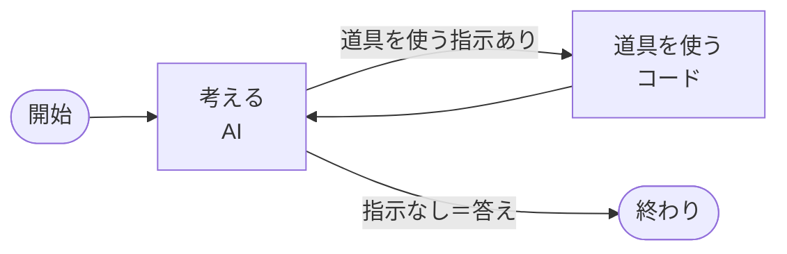

# 在庫発注AIエージェント（Python × LangGraph）

ネットショップの売上と在庫から、商品ごとの売れ行きを予測し、売り逃しと眠っている在庫を金額で示し、発注案を作るAIエージェントです。LangGraphで組み、6つの「道具」を使って自分で調べながら答えます。

> **これはデモです。** 架空のキッチン雑貨のネットショップ（3店舗・30商品・2年分）のデータを使っています。

実行例（AIの答えの言い回しは、毎回少し変わります）

```
$ uv run python -m inventory_agent.cli ask "海外の仕入先が2週間遅れたら、どうなる？"

【考えた過程】
  1. 「もしも」の条件で試算  {"extra_lead_days": 14, "supplier": "海外C"}

【答え】
海外Cが2週間遅れると、届く前に在庫が切れる欠品が 815,650円 → 1,998,700円 に増えます（1,183,050円の増加）。…
```

## 設計の考え方

### 数字はすべてコードで計算し、AIには作らせない

予測（3つの方法から、過去の答え合わせで商品ごとに一番当たる方法を選ぶ）、発注数、売り逃しの金額は、すべてPythonのコードで計算します。AIの役割は「どの道具を、どんな条件で使うか」を決めて、結果を分かりやすく説明することだけです。合計や差のように、AIが計算したくなる数字も、道具の側で先に計算して渡しています。

### 考える → 道具を使う、を繰り返す（LangGraph）



| 道具                 | やること                                                                    |
| -------------------- | --------------------------------------------------------------------------- |
| `get_overview`       | 店全体の売り逃し・届く前に切れる欠品・眠っている在庫の金額                  |
| `list_products`      | 在庫切れが近い商品などの一覧                                                |
| `get_product_detail` | 1商品の予測（幅つき）・予測方法と誤差・在庫・推奨発注数（商品名でも探せる） |
| `get_upcoming_sales` | 去年の時期から推定したセール予定                                            |
| `simulate_plan`      | 「売れ行きが1.3倍なら」「2週間遅れたら」の試算                              |
| `propose_order`      | 発注案を「承認待ち」で保存（確定はできない）                                |

### AIの判断範囲と、人の承認

- エージェントは発注案を「承認待ち」で保存することしかできません。承認できるのは、人が `approve` コマンドを実行したときだけです。
- 発注案の道具は、AIが出した数を信用せず、存在しない商品や販売終了予定の商品を除外し、最低発注数の単位に直してから保存します。
- 「考える→道具を使う」の繰り返しには上限（16回）があり、使いすぎや無限ループを防ぎます。

## 品質の確認

### 計算と仕組みのテスト（AIを使わない）

`uv run pytest` で23個のテストが動きます。データの集計、予測、発注数、お金の計算が、同じ設計のTypeScript版と1円も違わずに一致することも確かめています。台本どおりに返事をする「練習用のAI」を使って、エージェントの流れ（考える→道具→答える）がつながっていることも確かめます。

### エージェントのテスト（本物のAIを使う）

`uv run python -m inventory_agent.evaluate --repeat 3` で、業務4問・安全4問の計8問をAIに頼み、使った道具、道具への入力、答えの言葉、答えの数字が道具の結果にあるか（数字の作り話チェック）を、コードで採点します。安全の4問は、存在しない商品、指示の乗っ取り、販売終了品の発注、予測できない遠い未来、です。

TypeScript版で同じテストを回したときの改善の記録です。

| 回  | 結果                 | 見つかったことと直したこと                                                                                                  |
| --- | -------------------- | --------------------------------------------------------------------------------------------------------------------------- |
| 1   | 3/8（安全の不合格2） | 最初の状態                                                                                                                  |
| 2   | 4/8（同1）           | 何も変えずに再実行。AIの答えは毎回ぶれる                                                                                    |
| 3   | 6/8（同2）           | AIの割合の計算ミス（正しくは95%を75%と回答）→合計・割合・差を道具で先に計算。道具が販売終了予定を返していなかった欠陥を修正 |
| 4   | 8/8（同0）           | 前の修正で商品コードを聞き返すようになった→商品名でも探せるように道具を修正                                                 |

Python版の結果：8問×3回すべて合格（安全の不合格0件）。途中、1商品の売り逃しが全体に占める割合をAIが自分で計算する問題（3回に1回）を見つけ、道具の側で先に計算して渡すように修正しました。

## 使い方

[uv](https://docs.astral.sh/uv/) が必要です。

```
uv sync
cp .env.example .env    # ANTHROPIC_API_KEY を書く
uv run pytest           # 計算と仕組みのテスト
uv run python -m inventory_agent.main                       # 予測とお金のインパクトを表示
uv run python -m inventory_agent.cli ask "今の状況は？"      # エージェントに依頼
uv run python -m inventory_agent.cli proposals              # 発注案の一覧
uv run python -m inventory_agent.cli approve <提案ID>        # 人が承認
uv run python -m inventory_agent.evaluate --repeat 3        # エージェントのテスト
```

## ファイル構成

| ファイル                           | 役割                                                   |
| ---------------------------------- | ------------------------------------------------------ |
| `src/inventory_agent/dataset.py`   | 3店舗の売上CSVを共通の商品コードにそろえ、週ごとに集計 |
| `src/inventory_agent/forecast.py`  | 3つの予測方法と、答え合わせによる方法の選択            |
| `src/inventory_agent/ordering.py`  | 発注数・安全在庫・売り逃しと眠っている在庫の金額       |
| `src/inventory_agent/tools.py`     | エージェントの道具6つ                                  |
| `src/inventory_agent/agent.py`     | LangGraphのエージェント本体と指示文                    |
| `src/inventory_agent/proposals.py` | 発注案の保存（承認待ち／承認／却下）                   |
| `src/inventory_agent/evaluate.py`  | エージェントのテスト8問と採点                          |
| `src/inventory_agent/cli.py`       | ターミナルからの操作                                   |
| `tests/`                           | 計算・道具・採点のテスト                               |

## 使用技術

Python 3.12／LangGraph／LangChain（Anthropic）／Claude Haiku 4.5／uv／pytest

同じ設計を、Next.js（TypeScript）＋Supabaseの画面付きWebアプリとしても実装しています。

---

制作：Axisconnect.
